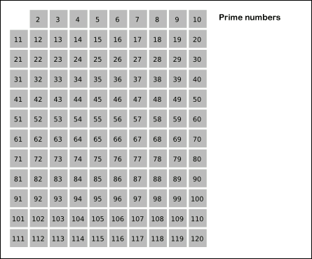
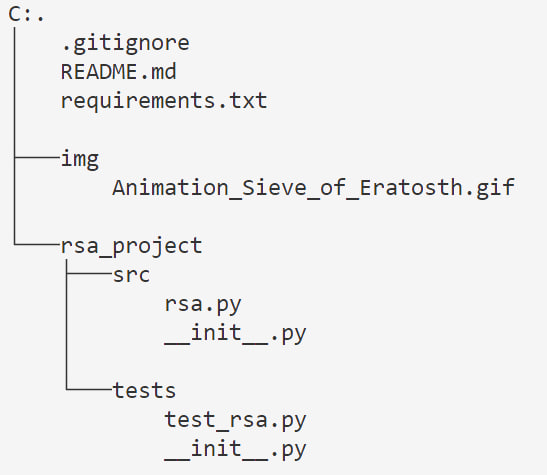

## Описание проекта:

**Асимметричное шифрование** - это метод шифрования данных, предполагающий использование двух ключей - открытого и закрытого. 
- Открытый (public) ключ применяется для шифрования информации, и может передаваться по незащищенным каналам. 
- Закрытый (private) ключ применяется для расшифровки данных, зашифрованных открытым ключом.

RSA относится к ассимитричному шифрованию. В рамках этой задачи необходимо реализовать алгоритм RSA, используя простые числа, не превышающие 10⁶. 

Для нахождения простых чисел в диапазоне [2, 10⁶] воспользуемся *решетом Эратосфена*.

## Структура проекта:

tree /F

## Этапы реализации RSA

1. Написание функции sieve, решета Эратосфена;

2. Рандомный выбор простых чисел p и q;

3. Вычисление модуля n и функции Эйлера φ(n): 
- n = p * q​
- φ(n) = (p - 1) * (q - 1)​

4. Выбор открытой экспоненты e: число e, такое что 1 < e < φ(n) и gcd(e, φ(n)) = 1.​

5. Вычисление закрытой экспоненты d: d, обратное к e по модулю φ(n), то есть d ≡ e⁻¹ mod φ(n).​

6. Формирование ключей:
- Открытый ключ: (e, n)​
- Закрытый ключ: (d, n)​

7. Шифрование и дешифрование сообщений:
- Шифрование: c = m^e mod n​
- Дешифрование: m = c^d mod n​